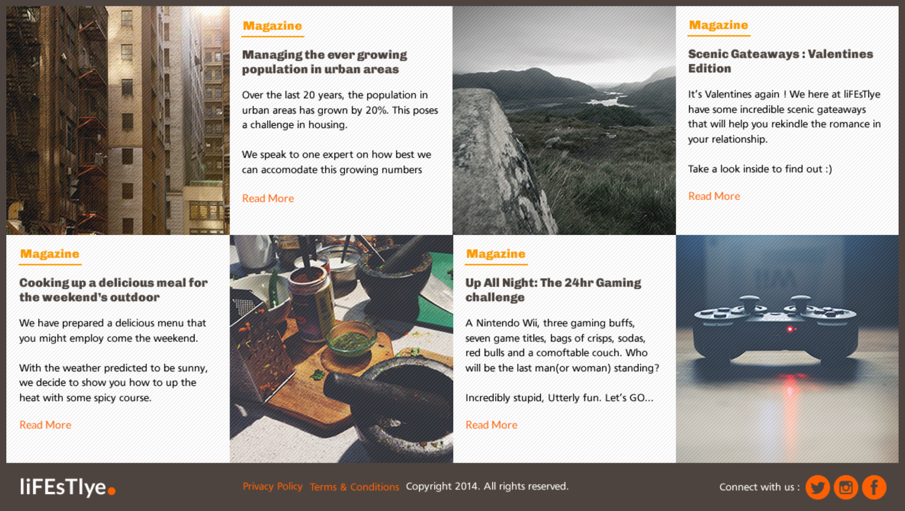
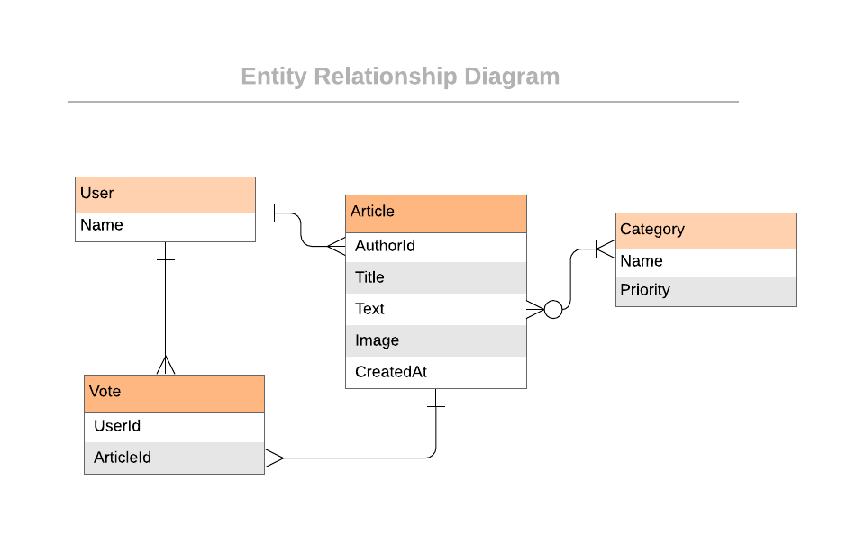

# LiFEsTYLe

The LiFEsTYLe is a blog created using Ruby on Rails. I have made this a simple blog that allows creating categories, and under each category, we can add articles. Then, we can add comments and votes for each article. Besides, the home page has some filtration to show the featured article, which has the biggest number of votes, and each category will represent by the latest article added to it.




## Live Demo

[Live Demo Link]( https://limitless-plains-70795.herokuapp.com/ )

## Loom Video
[1. Loom Video Link](https://www.loom.com/share/3fce9bd09bfd48e9baecb70d3602a35d)

[2. Loom Video Link](https://www.loom.com/share/6e49df5a567545fcbed90cd8cceada9f)

### **_Built With_** 

- Ruby on Rails
- Ruby ( version => 2.7.2 )
- Postgres database
- RSpec

### **_Application's Database Schema_** 


## **_Installation_** 

### To get a local copy up and running follow these simple example steps.

   1. To clone this repo run this code on a terminal window: 

      ```git clone https://github.com/Maha-Magdy/Life-Style.git```

   2. install gems by this command

      ```bundle install```

   3. Create the database by this command

      ```rails db: create```

   4. migrate the database by this command

      ```rails db:migrate```

   5. create your categories from rails console by this command

      ```rails console```

   6. Open rails sever by this command, then follow the link provided to open the application on your browser

      ```Rails server```

   7. Start to create a new user from your server by clicking the sign up link, then log in

   8. Start to add new articles by choosing WRITE AN ARTICLE option from the navbar.


**_Note: if webpacker::manifest::missingentry error occurs, you will need to run this command to solve the issue_** 

      rails webpacker:install

## **_Authors_**

### Maha Magdy 

- GitHub: [Maha-Magdy](https://github.com/Maha-Magdy)
- Twitter: [@Maha_M_Abdelaal](https://twitter.com/Maha_M_Abdelaal)
- LinkedIn: [Maha Magdy](https://www.linkedin.com/in/maha-magdy-abdelaal/)

### **_🤝 Contributing_** 

Contributions, issues, and feature requests are welcome!

Feel free to check the [issues page]( https://github.com/Maha-Magdy/Life-Style/issues ).

### **_Show your support_** 

Give a ⭐️ if you like this project!

### **_Acknowledgments_** 
[Nelson Sakwa, who owns the user interface design](https://www.behance.net/gallery/14554909/liFEsTlye-Mobile-version)

[Articles, which taken from CNN as a test dummy data](https://edition.cnn.com/)
### **_📝 License_** 

This project is [MIT](./LICENSE) licensed.
